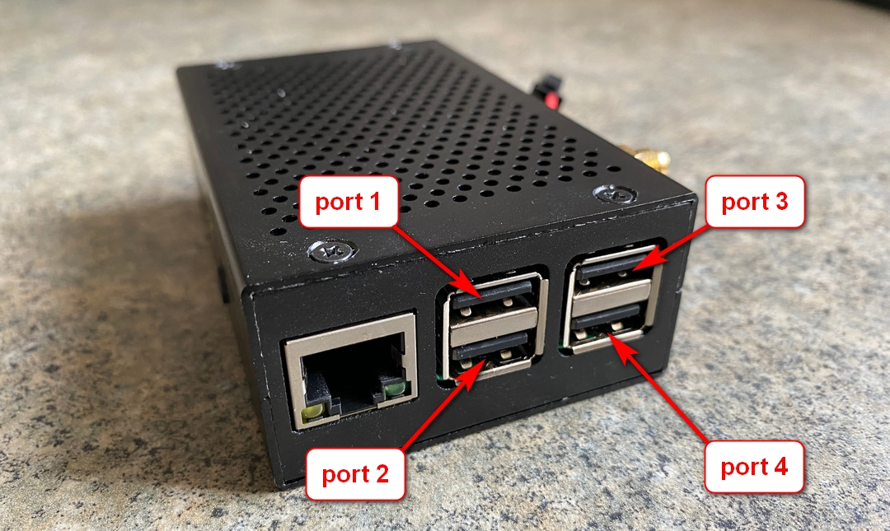
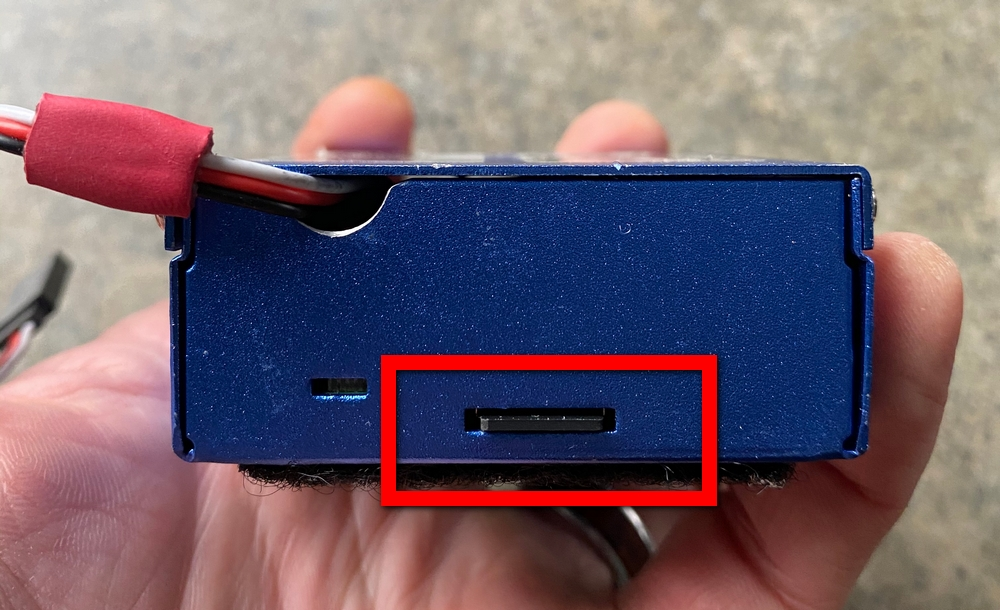
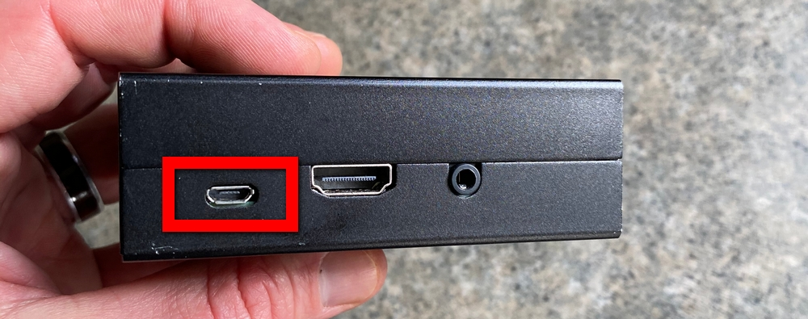
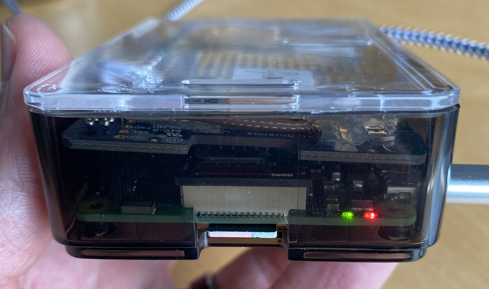
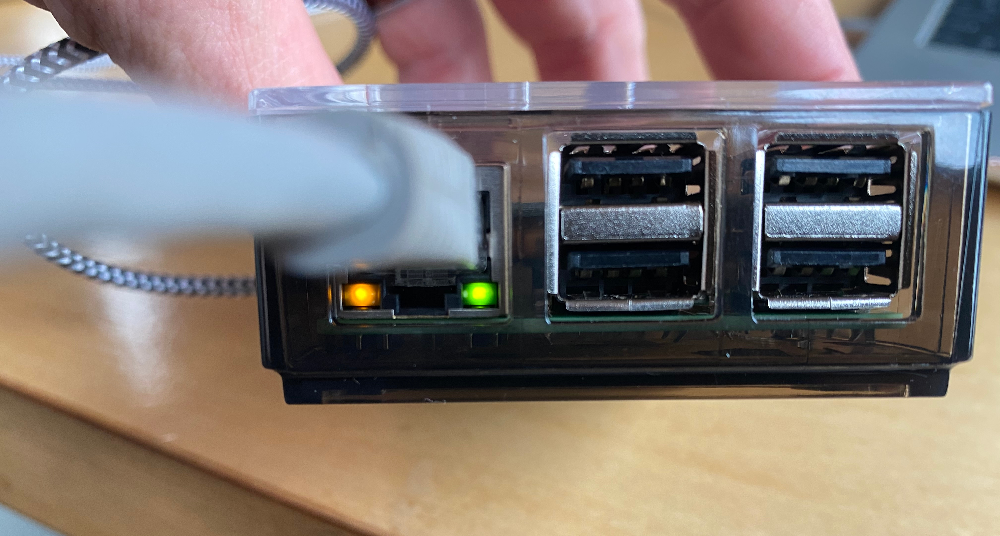
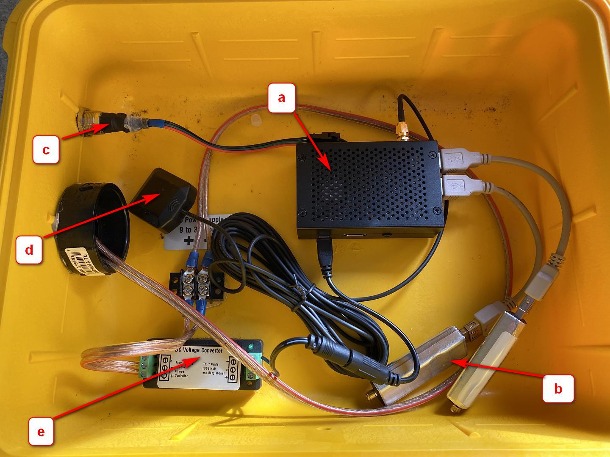

# Anatomy of a SensorGnome


This page has not yet been updated for the Sensorgnome V2 software!


## What's inside a SensorGnome?

Sensorgnomes contain the following components:

* Raspberry Pi single board computer, typ model 3B+ or 4B as of 2024. This runs the software that records the raw radio pulse data.&#x20;
* FUNcube USB dongles or other "software defined radios". These take the analog radio signals coming from the antennas and convert them into a digital format, ultimately to decode Lotek tag signals.
* CTT Motus Adapter USB dongles containing radios for the CTT 434Mhz tags.
* GPS. This records the precise location of the Sensorgnome, as well as ensures that the precise time is always recorded in data files.
* Associated power supply.

## Raspberry Pi

### Models 

* rPi 3B+ is the recommended model to use for a Sensorgnome due to the fact that its USB ports can directly support multiple FUNcube dongles. The rPi 3B ("non-plus") works just as well.
* rPi 4B also works, however its USB subsystem may cause difficulties as described in \[link missing]. However, with some attention to where FCDs are plugged in it can work great. The performance advantage and USB 3.0 support over a rPi 3B don't really come to bear in the Sensorgnome use-case.
* rPi Zero 2W can be useful in portable applications or other experiments. Due to the fact that it has only one micro-USB port it is not convenient to hook up lots of radios, but it does work.
* rPi 5 is not currently supported due to the fact that it requires a 64-bit operating system build and corresponding 64-bit application builds, which are not currently set-up. The rPi 5 hardware does not offer any benefits (at least none we know of) and it's more expensive and uses more power.
* rPi 1 and rPi 2 versions are not supported due to the fact that their processors cannot run the operating system version used for Sensorgnomes V2.

### Ports 

The numbering of the USB ports is very important when attaching antennas since this information is recorded along with detection data and can be used to determine the direction and time of approach or departure of a tagged animal.

To keep installers on their toes the port numbering is reversed between models 3B/3B+ and 4B!

#### Raspberry Pi 3B/3B+

#### Raspberry Pi 4B

<figure><figcaption></figcaption></figure>

### SD-card slot

The Micro-SD card slot is on the opposite side from the USB and Ethernet Ports. The card is inserted with the contacts facing up, and there is no click or other indicator when the card is inserted. On some cases the the Micro-SD is so deeply recessed that it cannot be removed without tweezers.

### Power

Power is supplied to a model 3B/3B+ through the a USB port. This port only supplies power and is not used to communicate with a computer.  On a model 4B a USB-C connector is used.

#### LED Lights 

LED lights can be useful in determining if the unit has power and if it is functioning properly.


There are many different cases used to house the Raspberry Pi. Not all of them permit a clear view of the lights.


The RPi itself has only two primary LED lights -- one red and one green. These are visible on the bottom right hand corner of the side that hosts the Micro-SD slot. The red light indicates power, while the green light should emit from 1 to 3 flashes every 2 seconds.&#x20;

The attached GPS had also has an indicator light, in this case a red LED. It does not light up consistently but instead blinks occasionally. If you are having trouble connecting and the green light never illuminates, you may need a [fresh software card.](broken-reference)

Lastly, there are two indicator lights on the bottom of the Ethernet port. When the Ethernet cable is attached to a computer these lights should be on or flashing consistently.

### GPS 

### Fully assembled RPi SensorGnome

**a)** The Raspberry Pi. The colour of the RPi case may vary between Sensorgnomes’s but they will also be roughly the same size

**b)** FunCUBE Dongles. A Raspberry Pi SG can accommodate up to 4 dongles plugged directly into the RPi (however, an rPi 4B can only support one directly plugged in FUNcube!). In order to accommodate additional antennas, a USB hub would be required. The cables from the antennas will plug into the free end of the dongles.

**c)** This is the inside view of the button used to activate the WiFi hotspot.

**d)** GPS antenna. When deployed in the field, this end of the antenna would be outside the SG case, and attached to something that had a clear view of the sky. The other end is attached to the Raspberry Pi by way of the gold-coloured “SMA” port on the top right corner of this particular RPi.

**e)** Voltage converter. If powered by a solar panel and battery, as this SG is, the power coming in will be 12V. However the RPi only requires 5V, so a voltage converter is used to downgrade the current to the acceptable level. If powered directly by AC power, the wall adapter itself should output 5V, eliminating the need for a voltage converter.
