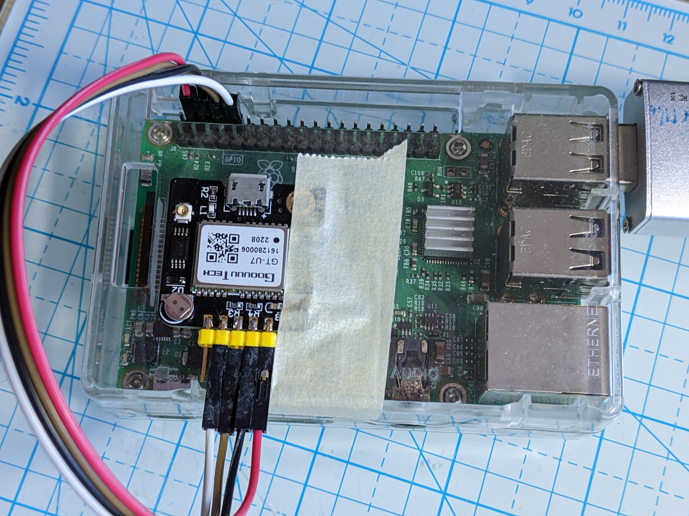

# GPS options

The Sensorgnome is best equipped with a GPS although this is not a hard requirement. The GPS performs two functions:

* it provides accurate time to timestamp tag detections
* it provides accurate station location even if the SG is relocated and no-one updates the metadata manually (common...)

If no GPS unit is present the Sensorgnome can obtain the time from the network using NTP (network time protocol). This assumes an always-on internet connection. If neither GPS nor NTP are available the date\&time will be completely unusable at the first reboot as the Raspberry Pi hardware does not have any real-time clock.

## Cell modem GPS

If the Sensorgnome is equipped with a cell modem then in the vast majority of cases it uses the generally built-in GPS unit. This does require connecting a GPS antenna to the cell modem and ensuring it has good sky view (and is not inside of a metal enclosure).

If the Sensorgnome does not detect the GPS (check the Web UI overview tab) please post on the forum (ensure the SG is connected to the internet so it can upload log files).

If the Sensorgnome detects the GPS unit but does not get a fix the problem most likely is the antenna or its placement. Note that some GPS units require an "active" antenna which has an amplifier (LNA) built-in and some don't.

## Adafruit GPS HAT

The hardware installation of the Adafruit GPS should be documented in the "How to build a Sensorgtnome" section (which is empty at the moment).

From the point of view of making the GPS work: the GPS HAT contains a small eeprom chip that identifies the HAT to the operating system and the Sensorgnome software sets everything up automatically. Note that stacking two HATs is not supported by the rPi as it breaks the HAT detection.

## Discrete GPS unit

It is possible to connect a "generic" GPS breakout board to the Sensorgnome. Please purchase from a reputable seller as many "U-Blox" GPS breakouts are fake and contain knock-off devices. A (genuine) U-Blox GPS is a good choice because it supports a fast binary protocol which gives good time synchronization without PPS (pulse per second) signal.

You can connect a GPS either via USB or serial. Connecting via USB is recommended and "it should just work", although if the web UI shows "no-dev" 5 minutes after boot then post for help on the forum. (It does sometimes take a couple of _minutes_ for gpsd to detect and configure the GPS device and then the Web UI to figure that out, use `gpsmon` on the commandline to get quicker feedback.)

You can also connect via serial using 4 jumper wires. You will need to connect to the Raspberry Pi's GND, 5V, Uart-TX/gpio14, and Uart-RX/gpio15. Search for "raspberry pinout" and you will find many pictures that show the rPi connector pin assignment. The 4 pins you need to connect to are all next to each other on the outer row. Note that TX on the rPi goes to RX on the GPS module and RX on the rPi to TX on the GPS. In addition, if the GPS provides a PPS pin (Pulse Per Second) it can be connected to pin 7 / GPIO4.

After hooking up the GPS hardware you need to boot your rPi and SSH in. Then issue the commands (this will reboot the SG!):

```
sudo tee /etc/sensorgnome/force-hat <<<"Ultimate GPS HAT"
sudo reboot
```

To troubleshoot the GPS log in via SSH and run `gpsmon`, if you just get a couple of lines then gpsd (the GPS management daemon) is not talking to the GPS. Double-check your connections (especially RX-TX cross-over), ensure the Sensorgnome is connected to the internet so it can upload its log files and contact the sensorgnomads mailing list with the ID of your Sensorgnome. If gpsmon shows lots of GPS info that updates every second or two then your GPS is working fine.

Another troubleshooting avenue is `/var/log/syslog`: restart gpsd (`sudo systemctl restart gpsd`) and look at what it prints in `/var/log/syslog`. It goes through a number of devices, including `/dev/ttyUSB0` and `/dev/serial0`. If you see an error for the device your GPS is using that may provide clues about what is going wrong.

For USB-connected GPS modules the tty device created may not be in the list scanned by GPSD. Use `lsusb` to verify the presence of your GPS device and `ls -l /dev/serial/by-id` to glean which ttyXXX port is used. Then edit `/etc/default/gpsd` to make sure it's in the list and restart gpsd (`sudo systemctl restart gpsd`).

In the US, the author has been successful with 2 purchases of the following GPS module available on Amazon: https://www.amazon.com/gp/product/B07P8YMVNT and the serial connection looks something like this (please use pinout diagrams! and oops, should have connected the PPS pin as well...):

<figure><figcaption><p>GPS connected to rPi3 using serial cable for illustration (this is not a permanent install...)</p></figcaption></figure>

\
\
\
