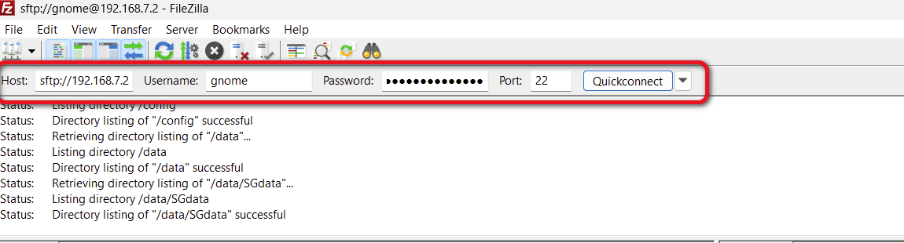

# Downloading data

If the SensorGnome is connected to the internet, it automatically uploads data to Motus and manual downloads are not required. For non-internet-connected SGs, there are two main methods of manually downloading the data to your computer in order to upload it to Motus.

Both methods are possible on either a computer or smartphone. You must first connect to SG via its WiFi hotspot.

#### The SensorGnome web interface

On the SG web interface, navigate to the Files tab. The SensorGnome keeps track of which files have been _uploaded_ to Motus servers and which files have been _downloaded_ to a computer using the web UI.

* the red Download button produces a ZIP archive with all files that have not been previously downloaded
* the All button produces a ZIP with all files
* the Repeat button re-downloads the previous download (in case an error occurred)
* the Upload button kicks-off an upload to Motus, useful if the SensorGnome has temporary internet access through your phone, for example


The SensorGnome has no way of knowing if a download actually succeeded and will update the "Last Download" field as soon as the download begins. If the download via the web interface was unsuccessful or interrupted, it will still appear as if all files up to that date were downloaded. If there&#x20;


<figure><figcaption>
Web UI for upload/download: <strong>upload</strong>=to Motus, <strong>download</strong>=to laptop/phone
</figcaption></figure>


The process of collecting the files to be downloaded into a ZIP archive can take a long time and your browser may feel like it's unresponsive for several seconds or minutes.


The downloaded ZIP files can and should be uploaded as-is to Motus using the Motus web site. If the SensorGnome uploads directly then manual uploads are redundant but not harmful.

#### Using an FTP client&#x20;

An FTP client with a graphical user interface can be a more efficient method of downloading data since it bypasses the process of creating a ZIP archive of the files to be downloaded and allows you to view and choose just the files you want to download.

There are multiple programs to you can use but the most populate cross-platform option is FileZilla.

After connecting to the SensorGnome's WiFi hotspot, open up FileZilla and fill in the information for the host at the top&#x20;

<figure><figcaption></figcaption></figure>

* `sftp://192.168.7.2` (or `sftp://sgpi.local`) as the host.
* `gnome` for the username. This is the default when configuring a SG for the first time
* whatever password you assigned when configuring the SG
* port number is 22
* click "Quickconnect"   &#x20;


If this is the first time connecting to the SG with this computer, you'll get a message asking you whether to trust the server's host key. Click yes.


After clicking Quickconnect, you should see 4 panels populate. The left hand side is your computer, and the right hand side is the SensorGnome. On the right hand side, navigate to `/data/SGdata` to view the detection data. Select the folders you need and copy them to you a folder on your computer on the right side.&#x20;

<figure><figcaption>
The two panels on the right hand side of a FileZilla session present files on the SensorGnome
</figcaption></figure>

#### Using a smartphone

Either of the methods described above will also work on a smartphone if needed. It can be more difficult to connect to the SG's hotspot with a smartphone because many phones will ignore a WiFi connection without internet access if you still have internet by other means. For this reason, it's best to turn off your phone's cell network and disconnect from or forget other WiFi if they are within range. Additionally, you may need to select the "Use this network without internet" option if your phone has that option.

Once connected, the process is more or less the same as downloading via the web browser. If downloading with the FTP method, you will likely need a dedicated app. Since the FTP method allows you more control and transparency over what you download, it's worth investing a bit of time to find a suitable FTP client app if you will frequently not have access to a laptop when conducting remote site visits. Below are a some free suggestions, though there are many others.

* **Android**&#x20;
  * [CX Explorer](https://play.google.com/store/apps/details?id=com.cxinventor.file.explorer\&hl=en-US). Simple interface and very user friendly. Go to Network > New Location > Remote > SFTP and then enter the credentials above. This app requires a password so any time you connect to a new SG you will need to re-enter the credentials with this process.
  * [Total Commander.](https://play.google.com/store/apps/details?id=com.ghisler.android.TotalCommander\&hl=en-US) Very powerful file manager with SFTP capability via a free plugin. From the home page, go to Add plugins > SFTP  and follow the prompts. From there, you "Add a connection" and enter the same credentials. Leave any existing default settings as they are. This app has the added advantage of not requiring a password when saving the connection profile, so you can more easily use it on multiple SG's without having to recreate the entire profile.
* **Apple**
  * [FTPManager](https://apps.apple.com/us/app/ftpmanager-ftp-sftp-client/id525959186). Easy to use app with SFTP options. You can either save the password or enter it each time, and additionally you can save the detection data path `/data/SGdata` so that it opens to the correct folder every time.
