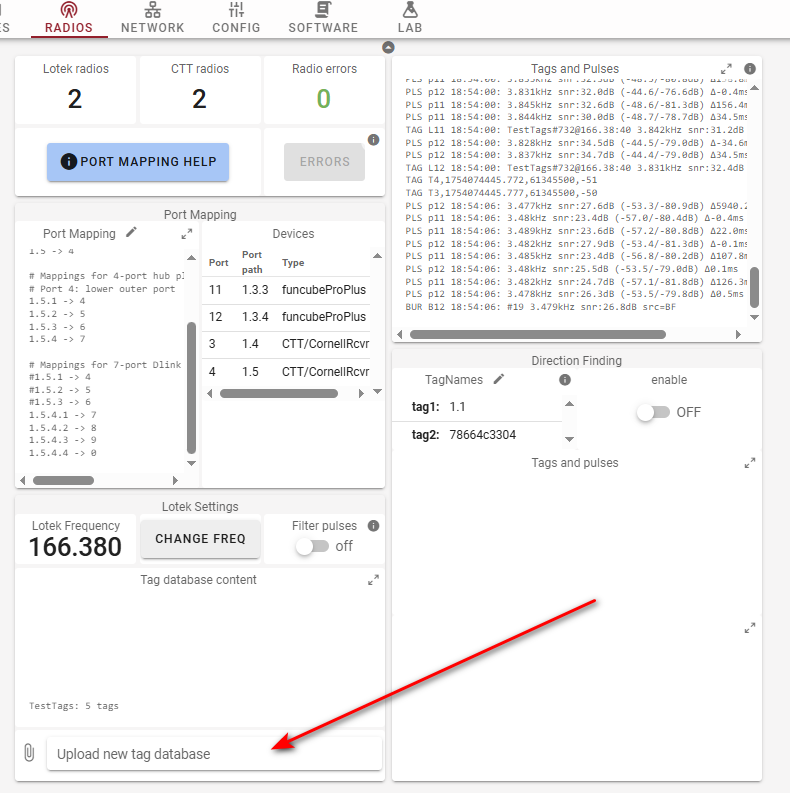

# Uploading a local tag database


If you are trying to upload a tag database to a SensorStation, or a V1 SensorGnome, refer to the [V1 SG guide](localtagdb.md).


## Introduction

If you are installing a station that detects Lotek tags, it is often useful to know whether it is able to detect tags in real time, particularly if you are deploying tags in the vicinity. Thankfully this is possible by loading a local tag database on to the internal storage of the device. When the SensorGnome boots up, it checks for a tag database and will display any of those tags it "hears" on its web interface.&#x20;

Viewing your live tag detections can also be useful when deploying tags or as a make-shift manual tracking device when a Lotek receiver is unavailable.

This works by using a local version of the tag finder algorithm ([`find_tags_unifile`](https://github.com/MotusWTS/find_tags)) in comparison with the tag recordings provided during registration.


There are some **very** important differences to be aware of between the tagfinder that runs on a SG and the one that runs on the Motus Server.&#x20;


The local tagfinder differs from the version found on Motus, in some key respects:

* It is only aware of the tags that you have provided, so its candidate list is minimal. It might therefore assign raw data to one of your tags even if a more suitable candidate exists in the Motus database
* It does not use deployment period or estimated battery life to assign data to candidate tags so it might "detect" a tag that has been dead for many years&#x20;
* It uses none of the [filters that are applied](https://docs.motus.org/en/about-motus/how-data-are-processed/public-data-filters) on the Motus website (and in the R data)&#x20;

All of this means that you will very often get different results on the local tagfinder as with data processed by the Motus server. Despite this, uploading a local tag database is recommended any time you are deploying tags.

### Steps

1. Navigate to your [project's tag management pages ](http://motus.org/data/project/tags) and click the "Download tag database" button

2\. Download the first option. This will contain all the tags currently registered to your project.

<figure><figcaption></figcaption></figure>


The additional options seen above are an earlier, depcreated, format that was summarized by yearly quarter. These will only be visible for older projects, and will almost never be needed.


3. Connect to your SensorGnome via the WiFi hotspot and navigate to the "Radios" tab. Click "Upload new tag database" and select the `.sqlite` file you just downloaded. You should now see an updated summary including the new project and the number of tags you added.


You can add `.sqlite` files from multiple projects without needing to merge them into one.


<figure><figcaption></figcaption></figure>
