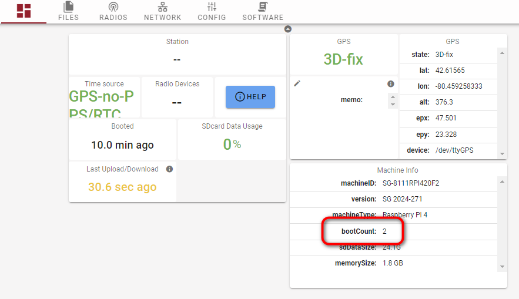

# Updating the boot number

### What is the boot number?

The boot number is a cumulative marker of how many times a SG has rebooted. It is represented in the file name as well as the web interface in the V2 SensorGnome.&#x20;

<figure><figcaption>
The current boot number displayed in the V2 SG web interface
</figcaption></figure>

<figure><figcaption>
The boot number is embedded in the detection data file name (on both V1 and V2 SG)
</figcaption></figure>

The boot number is an essential component when processing detection data as it can account for bad timestamps (when the GPS reports an incorrect date/time) and for stringing together long detection runs that overlap multiple uploaded batches. Because the `tagfinder` algorithm works under the assumption that the boot number _always_ increments, issues can arise when the boot number is reset.

### When is the boot number reset?

When upgrading a SensorGnome's software with a _newly flashed_ SD card, the boot number in the file names will be reset to `0`. This applies to V2 SG with a card that's been flashed with the software,  V1 SG where the software files have copied to a new card, and SG running on BeagleBones. Since this will violate the assumption that the boot number always increments, this may result in missing or false detections until the [receiver data is reprocessed](https://docs.motus.org/en/about-motus/how-data-are-processed/reprocessing-receiver-data).


If updating a V2 SG over the internet using the web interface, the proper boot number sequence is retained.


### How to update the boot number


Updating the boot number is only possible on the V2 SensorGnome software running on a Raspberry Pi.

If you cannot, or prefer not to, run V2 SG on a Raspberry Pi, the boot number will only be corrected after the receiver data is reprocessed. You can read more about reprocessing receiver data [here](https://docs.motus.org/en/about-motus/how-data-are-processed/reprocessing-receiver-data).


**Before updating the software**, connect to the SensorGnome and visit the web interface. From the landing page, you should be able to see the current boot number (as the screenshot above shows).

Navigate to the "software" tab, and on the lower right select the "edit" button (the one that looks like a pencil) to update the boot number.&#x20;

Feel free to set the number slightly higher than necessary then reboot the SG and confirm that the change has persisted when you connect again.

<figure><figcaption></figcaption></figure>

